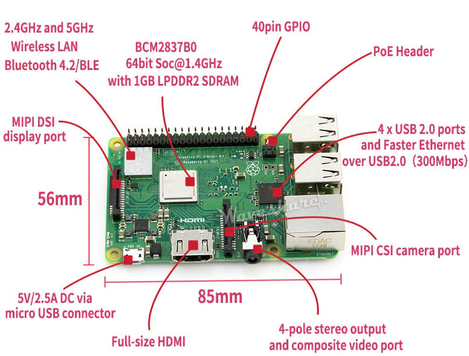

# Raspberry Pi (3) Information

* Scoop.it! for [Single board computers and embedded Linux](https://www.scoop.it/t/single-board-computers-and-embedded-linux-dev-boards)
* [FrendlyARM](https://friendlyarm.com/) : [Wiki](http://wiki.friendlyarm.com/wiki/index.php/Main_Page), [Github](https://github.com/friendlyarm)
* [Raspberry Pi 3 Model B+](https://people.rit.edu/meseec/551-projects/spring2018/2-1.pdf)



## Hardware
- 2018/09/20 [Best SD card for the Raspberry Pi 3 B+](https://www.androidcentral.com/best-sd-card-raspberry-pi-3-b)
- 2018/08/24 [NanoPi M4 Raspberry Pi Inspired RK3399 Board Launched for $65 and Up](https://www.cnx-software.com/2018/08/24/nanopi-m4-raspberry-pi-rk3399-board/)
- 2018/01/31 [What’s the Best Raspberry Pi Camera For Your Project?](https://randomnerdtutorials.com/best-raspberry-pi-camera-for-your-project/)

```
$ vcgencmd get_camera
```

## OS Images
- [Raspberry Pi Images](https://www.raspberrypi.org/downloads/)
    - [Raspberry Pi SD image – Raspbian (Linux OS)](http://domoticx.com/raspberry-pi-sd-image-raspbian-linux-os/) - RPi 1,2,3
    - [firmware-nonfree/](https://archive.raspberrypi.org/debian/pool/main/f/firmware-nonfree/) - patched wifi driver
- [Ubuntu MATE 16.04.2 (Xenial)](https://ubuntu-mate.org/download/) - patch required
- [armbian](https://www.armbian.com/) - Linux for ARM development boards
- [Chromium OS Builds](https://chromium.arnoldthebat.co.uk/)
- [Flint OS](https://flintos.io/) - Open source version of Chromium OS for PC/TKB/RPi
    - [Flint Innovations](https://github.com/flintinnovations)


```
$ sudo apt-get install xz-utils
$ unxz <file>.xz

$ sudo apt-get install p7zip-full p7zip-rar
$ 7z x <package>.7z

$ dd bs=4M if=2018-04-18-raspbian-stretch.img of=/dev/sdX conv=fsync
$ unzip -p 2018-04-18-raspbian-stretch.zip | sudo dd of=/dev/sdX bs=4M conv=fsync
$ dd bs=4M if=2018-04-18-raspbian-stretch.img of=/dev/sdX status=progress conv=fsync
```

To get back to the latest stable firmware/kernel
```
$ sudo apt-get install --reinstall raspberrypi-bootloader raspberrypi-kernel
$ sudo BRANCH=stable rpi-update
```

To fix the error of firefox on Ubuntu Mate 16.04 for Raspberry Pi
```
$ sudo apt-get install firefox=45.0.2+build1-0ubuntu1
$ sudo apt-mark hold firefox
```

### On-line Stores
- [엘레파츠](https://www.eleparts.co.kr/)
- [아이씨뱅크](http://www.icbanq.com/)
- [Aliexpress](https://www.aliexpress.com)
    - [Raspberry Pi 3 Model B+](https://www.aliexpress.com/premium/raspberry-pi-3-model-b%252B.html)
    - [NanoPi M4](https://www.aliexpress.com/premium/nanopi-m4.html) - RK3399


### Domestic Information
- 2018/08/26 [Raspberry Pi 3 무선랜(WiFi) 설정 방법](http://webnautes.tistory.com/903)
- 2018/07/14 [라즈베리 파이 문서](https://wikidocs.net/book/483)
    - [(1) 리눅스에서 운영 체제 이미지 설치하기](https://wikidocs.net/3275)
- 2018/06/25 [Raspberry Pi Camera Module( pi camera ) 사용하는 방법](http://webnautes.tistory.com/929)
- 2018/06/01 [라즈베리파이3 B+ 개봉 및 부팅테스트](https://m.blog.naver.com/nettrail/221289334287)
- 2018/03/20 [모니터 없이 라즈베리파이 3 모델 B+의 SSH, VNC 원격접속 설정](https://m.blog.naver.com/PostView.nhn?blogId=specialist0&logNo=221232983680&proxyReferer=https%3A%2F%2Fwww.google.co.kr%2F)


### Foreign Information
- 2018/09/26 [Install OpenCV 4 on your Raspberry Pi](https://www.pyimagesearch.com/2018/09/26/install-opencv-4-on-your-raspberry-pi/)
- [Where to download latest Android and Chromium OS for Rasp Pi3](https://lb.raspberrypi.org/forums/viewtopic.php?t=194047)
- 2018/06/23 [Getting Started with Chromium OS on Raspberry Pi](https://www.electromaker.io/tutorial/blog/getting-started-with-chromium-os-on-raspberry-pi)
- [Raspbian Update: First-Boot Setup Wizard and More](https://www.raspberrypi.org/blog/raspbian-update-june-2018/)

- [Creating a bootable Ubuntu USB stick](https://tutorials.ubuntu.com/tutorial/tutorial-create-a-usb-stick-on-ubuntu#0)
- [Installing OS Images on Linux](https://www.raspberrypi.org/documentation/installation/installing-images/linux.md)
- 2018/06/04 [Install Ubuntu 16.04 MATE or Ubuntu 18.04 On Raspberry Pi](https://linuxconfig.org/install-ubuntu-16-04-mate-or-ubuntu-18-04-on-raspberry-pi)
- [ARM Pi Media Server Installer Images Download Page](https://www.htpcguides.com/arm-pi-media-server-installer-images-download-page/)
- 2018/04/18 [The ASUS Tinker Board is a compelling upgrade from a Raspberry Pi 3 B+](https://www.jeffgeerling.com/blog/2018/asus-tinker-board-compelling-upgrade-raspberry-pi-3-b)
- 2018/04/15 [Raspberry Pi 3 B+ Review and Performance Comparison](https://www.jeffgeerling.com/blog/2018/raspberry-pi-3-b-review-and-performance-comparison)
- [Setting WiFi up via the command line](https://www.raspberrypi.org/documentation/configuration/wireless/wireless-cli.md)


## Awesome
- [thibmaek/awesome-raspberry-pi](https://github.com/thibmaek/awesome-raspberry-pi)
- [blackout314/awesome-raspberry-pi](https://github.com/blackout314/awesome-raspberry-pi)
- [Devices with Videocore graphics](https://github.com/anholt/linux/wiki/Devices-with-Videocore-graphics)
- [314 (or so) Awesome Raspberry Pi Resources on Pi Day](https://grantwinney.com/314-awesome-raspberry-pi-resources/)


## Terminoloy
- MMAL(Multi-Media Abstraction Layer)
- OMX (OpenMAX)

## Commands
```
$ sudo raspi-config
$ sudo apt {update,upgrade,dist-upgrade,full-upgrade}
$ sudo rpi-update
```

### [RPi WebRTC Streamer](https://github.com/kclyu/rpi-webrtc-streamer-deb)
```
$ sudo dpkg -i rws_xxx_armhf.deb
$ sudo dpkg -r rws

$ sudo systemctl {start,stop,status} rws
$ sudo journalctl -u rws

> http://localhost:8889/native-peerconnection
```


## Tools
- [Ether.io](https://etcher.io/) - Flash OS images to SD cards & USB drives, safely and easily.
- raspistill
```
$ raspistill -vf -hf -o test.jpg
```

- raspivid, raspiyuv, raspividyuv
```
$ raspivid -t 5000 -o video.h264
$ omxplayer video.h264

$ raspivid -vf --demo -t 10000
$ raspivid -ex nightpreview -w 1640 -h 1232 -t 10000
```

- [omxplayer](https://github.com/popcornmix/omxplayer)
```
$ omxplayer -p -o hdmi video.mp4
$ omxplayer -o local video.mp4
```
- amixer
```
$ sudo amixer cset numid=3 2 (HDMI)
$ sudo amixer cset numid=3 1 (Audio Jack)
```

### Configuration
```
$ cat /etc/os-release

$ cat /etc/modules
snd-bcm2835
bcm2835-v4l2

$ sudo modprobe -v bcm2835-v4l2 # load driver
$ sudo modprobe -r bcm2835-v4l2 # remove

$ sudo uv4l --driver raspicam --auto-video_nr --encoding h264

$ v4l2-ctl -V
$ v4l2-ctl --set-fmt-video=width=640,height=480,pixelformat=4
$ v4l2-ctl --set-ctrl=exposure_dynamic_framerate=1 --set-ctrl=scene_mode=8
$ v4l2-ctl --list-ctrls-menu -d 0 (--device=/dev/video0)
```

RPi RTSP Server Test
```
$ v4l2rtspserver
$ v4l2rtspserver -F -W 1920 -H 1080 -P8554 /dev/video0
$ vlc rtsp://<ip:8554>/unicast
```

### Magazine & Books
- [The MagPi](https://www.raspberrypi.org/magpi/)

- 2016 [Raspberry Pi: Amazing Projects from Scratch](https://electrovolt.ir/wp-content/uploads/2018/01/Raspberry_Pi_Amazing_Projects_from_Scratch_ElectroVolt.ir_.pdf)


### Reference
- [Linux Media Subsystem Documentation](https://linuxtv.org/downloads/v4l-dvb-apis-new/index.html)
    - [Video for Linux API](https://linuxtv.org/downloads/v4l-dvb-apis-new/uapi/v4l/v4l2.html)
    - [Video4Linux (V4L) driver](https://linuxtv.org/downloads/v4l-dvb-apis-new/v4l-drivers/index.html)
- [UV4L on Raspbian](http://www.linux-projects.org/uv4l/) - User space Video4Linux
- [Building From Source on Raspberry Pi](https://supercollider.github.io/development/building-raspberrypi)
- richard's technotes [Category: video Streaming](https://richardstechnotes.com/category/video-streaming) - YOLOv3, AIY Vision Kit
- [Raspberry Pi/Camera streaming](https://wiki.marcluerssen.de/index.php?title=Raspberry_Pi/Camera_streaming)
- [[RaspberryPi3] V4L2를 이용한 영상 스트리밍](http://inmile.tistory.com/24)
- [The Only Raspberry Pi 3 Kodi Tutorial You Will Ever Need](https://mediaexperience.com/raspberry-pi-xbmc-with-raspbmc/)


### Open Source
- [raspberrypi](https://github.com/raspberrypi)
    - [raspberrypi/userland](https://github.com/raspberrypi/userland) - RPi GPU
    - [raspberrypi/firmware](https://github.com/raspberrypi/firmware) - RPi kernel and modules, userspace libraries, and bootloader/GPU firmware 
- [6by9/lens_shading](https://github.com/6by9/lens_shading) - Lens shading analysis tool
- [6by9/raspi_tc358743](https://github.com/6by9/raspi_tc358743) - Raspberry Pi Userland app for talking to the TC358743 HDMI to CSI-2 bridge chip
- [6by9/v4l2_mmal](https://github.com/6by9/v4l2_mmal) - V4L2 source feeding into MMAL for encode and render
    - [B101 HDMI to CSI-2 Bridge (15 pin FPC)](https://auvidea.com/b101-hdmi-to-csi-2-bridge-15-pin-fpc/)

- [technomancers/piCamera](https://github.com/technomancers/piCamera) 
- [rakyll/go-hardware](https://github.com/rakyll/go-hardware)
- [tasanakorn/rpi-mmal-demo](https://github.com/tasanakorn/rpi-mmal-demo) - mmaldemo
- [sodnpoo/rpi-mmal-opencv-modetect](https://github.com/sodnpoo/rpi-mmal-opencv-modetect)
- [mpromonet/rpi](https://github.com/mpromonet/rpi)

- [limhyon/guvcview](https://github.com/limhyon/guvcview)
- [gokrazy](https://gokrazy.org) - pure-Go userland for your Raspberry Pi 3 appliances


## [WebRTC](https://webrtc.org/)

- [WebRTC](https://webrtc.org)
    - [getusermedia](http://simpl.info/getusermedia) - camera test
    - [getusermedia/sources/](https://simpl.info/getusermedia/sources/) - camera source test, 3B(unstable), 3B+(ok, not fully)
    - [AppRTC](https://apprtc.appspot.com)
- [LIVE555TM WebRTC Demonstration](http://webrtc.live555.com/)
	- LIVE555 WebRTC Proxy Server
- [Interoperating WebRTC and IP cameras](http://www.kurento.org/blog/interoperating-webrtc-and-ip-cameras)
- [Low-Latency Video Streaming from RPi To Mobile Application](http://www.youngscientistusa.com/archive/10/462/) - Janus gateway, ionic for iOS
- [Using WebRTC for Real-Time Image Filtering](https://sudo.isl.co/webrtc-real-time-image-filtering/)


### Information
- 2015/02/25 [Building a Raspberry Pi 2 WebRTC camera](https://www.rs-online.com/designspark/building-a-raspberry-pi-2-webrtc-camera) - Janus and gStreamer
- [WebRTC-streamer](http://www.lib4dev.com/info/mpromonet/webrtc-streamer/27565754)
- [Browser-based WebRTC stream from RTSP IP camera with low latency](https://flashphoner.com/browser-based-webrtc-stream-from-rtsp-ip-camera-with-low-latency/)
- [Testing playback of the WebRTC Video stream in an HLS player](https://flashphoner.com/testing-of-a-webrtc-stream-broadcasting-to-hls/)


### Open Source
- [webrtc.googlesource.com/src](https://webrtc.googlesource.com/src) - native code
- [mpromonet/v4l2tools](https://github.com/mpromonet/v4l2tools) - V4L2 tools using V4L2 C++ wrapper
- [mpromonet/v4l2web](https://github.com/mpromonet/v4l2web)
- [mpromonet/v4l2rtspserver](https://github.com/mpromonet/v4l2rtspserver) - tested (Ok with VLC)
- [mpromonet/webrtc-streamer](https://github.com/mpromonet/webrtc-streamer)
- [kclyu/rpi-webrtc-streamer](https://github.com/kclyu/rpi-webrtc-streamer)
    - [kclyu/rpi-webrtc-streamer-deb](https://github.com/kclyu/rpi-webrtc-streamer-deb) - Rpi WebRTC Streamer DEB packages
- [kclyu/rpi-webrtc-streamer-frontend](https://github.com/kclyu/rpi-webrtc-streamer-frontend)
- [meetecho/janus-gateway](https://github.com/meetecho/janus-gateway) - WebRTC Server
- [DaewoongP/cerule-stream](https://github.com/DaewoongP/cerule-stream) - Application Object detection using Neural Networks, Python and Open CV (with Raspberry pi)
- [carlosedp/rpi-media-server](https://github.com/carlosedp/rpi-media-server) - Docker compose files to create a Raspberry Pi Media Server


## Docker
- Installation: docker-ce
```sh
$ curl -sSL https://get.docker.com | sh
$ sudo groupadd docker
$ sudo gpasswd -a $USER docker
$ sudo apt-get install acl -y   # setfacl
$ sudo setfacl -m user:$USER:rw /var/run/docker.sock
```

## Golang
- Download: [golang 1.10.4, 1.11.1](https://golang.org/dl/) 
- [Raspberry Pi Coding in Go: Traffic Lights](https://medium.com/@simon_prickett/raspberry-pi-coding-in-go-traffic-lights-559bc761fa07)


### Open Source
- [fatih/vim-go](https://github.com/fatih/vim-go)
- [fatih/vim-go-tutorial](https://github.com/fatih/vim-go-tutorial)
- [stianeikeland/go-rpio](https://github.com/stianeikeland/go-rpio)
- [d2r2/go-i2c](https://github.com/d2r2/go-i2c)


## RPi Cluster
- 2018/09/28 [Digging into Kubernetes 1.12](https://cloud.google.com/blog/products/containers-kubernetes/digging-into-kubernetes-1-12)
- 2018/07/11 [How to run Kubernetes on Raspberry Pi cluster](https://www.olindata.com/en/blog/2018/07/how-run-kubernetes-raspberry-pi-cluster)
- 2018/06/11 [Raspberry Pi Zero cluster with the ClusterHAT](http://www.knight-of-pi.org/raspberry-pi-zero-cluster-with-the-clusterhat/)
- 2018/05/02 [Raspberry Pi Kubernetes Cluster - Part 2](https://blog.jasonmeridth.com/posts/raspberry-pi-kubernetes-cluster-part-2/)
- 2018/04/07 [Raspberry Pi Kubernetes Cluster - Part 1](https://blog.jasonmeridth.com/posts/raspberry-pi-kubernetes-cluster-part-1/)
- 2018/02/22 [Building an ARM Kubernetes Cluster](https://itnext.io/building-an-arm-kubernetes-cluster-ef31032636f9)
- 2018/02/22 [Kubernetes 1.9 on a Raspberry Pi Cluster](https://harthoover.com/kubernetes-1.9-on-a-raspberry-pi-cluster/)
- 2017/12/21 [Setup a Kubernetes 1.9.0 Raspberry Pi cluster on Raspbian using Kubeadm](https://kubecloud.io/setup-a-kubernetes-1-9-0-raspberry-pi-cluster-on-raspbian-using-kubeadm-f8b3b85bc2d1)


### Open Source
- [PicoCluster](https://www.picocluster.com/)
- [JestonBlu/Pi-Cluster](https://github.com/JestonBlu/Pi-Cluster) - How to set up a Raspberry Pi Spark Cluster on Arch
- [rak8s.io](https://rak8s.io/) - Stand up a Raspberry Pi based Kubernetes cluster with Ansible
- [geerlingguy/raspberry-pi-dramble](https://github.com/geerlingguy/raspberry-pi-dramble) - Raspberry Pi Kubernetes cluster that runs HA/HP Drupal 8


## RPi Mining
- 2018/01/28 [Building a mining-stack of Raspberry Pi’s (rev 3 Model B)](https://sharedmemorydump.net/building-a-mining-stack-of-raspberry-pis)
- 2018/01/20 [Cryptocurrency Mining on the Raspberry Pi](https://www.electromaker.io/tutorial/blog/cryptocurrency-mining-on-the-raspberry-pi-60)
- 2018/01/19 [Use A Raspberry Pi And A CPU Miner To Mine Altcoins](https://www.thepolyglotdeveloper.com/2018/01/use-raspberry-pi-cpu-miner-mine-altcoins/)
- 2018/01/19 [My Raspberry Pi Kubernetes Cluster](https://dzone.com/articles/my-raspberry-pi-kubernetes-cluster)


### Open Source

- [Cryptocurrency Mining](https://universalcryptonews.com/category/cryptocurrency-mining/)
- [Cryptocurrency GUI miner 8.3 & Mining Pool](https://minergate.com/)
- [luke-jr/bfgminer](https://github.com/luke-jr/bfgminer)
- [novaspirit/wolf-m7m-cpuminer](https://github.com/novaspirit/wolf-m7m-cpuminer)
- [tpruvot/cpuminer-multi](https://github.com/tpruvot/cpuminer-multi)


## AI Device
- 2018/09/14 [Picroft Migrates to Raspbian Stretch: Picroft Now Available for Raspberry Pi 3 B+](https://www.electromaker.io/blog/article/picroft-migrates-to-raspbian-stretch-picroft-now-available-for-raspberry-pi-3-b)
    - 2017//12/27 [Make Your Own Virtual Assistant with Mycroft](https://www.electromaker.io/tutorial/blog/make-your-own-virtual-assistant-with-mycroft-47)
- 2018/09/11 [DIY How to Build DIY AI Projects Using Google TensorFlow and Raspberry Pi](https://www.makeuseof.com/tag/google-tensorflow-raspberry-pi/)
- 2018/04/04 [How to Develop AI on a Raspberry Pi With Google Colaboratory](https://www.designnews.com/design-hardware-software/how-develop-ai-on-raspberry-pi-google-colaboratory/206379795358509)
- 2017/11/11 [Movidus Neural Compute Stick and Raspberry 3 - quick start guide](https://medium.com/@hsheil/movidius-neural-compute-stick-and-raspberry-3-quick-start-guide-a89ff5e1d7ca)


### Project
- [pyimagesearch](https://www.pyimagesearch.com/)
- [Artificial Intelligence & Machine Learning](https://www.hackster.io/artificial-intelligence/projects)
- [Google AIY Project](https://aiyprojects.withgoogle.com/) - Do-it-yourself artificial intelligence
- [Mycroft](https://mycroft.ai/) – Open Source Voice Assistant


### Open Source
- [google/aiyprojects-raspbian](https://github.com/google/aiyprojects-raspbian) - API libraries, samples, and system images for AIY Projects (Voice Kit and Vision Kit)
- [MycroftAI/enclosure-picroft](https://github.com/MycroftAI/enclosure-picroft) - Mycroft interface for Raspberry Pi environment
- [movidius/ncappzoo](https://github.com/movidius/ncappzoo) - Contains examples for the Movidius Neural Compute Stick
- [shivasiddharth/GassistPi](https://github.com/shivasiddharth/GassistPi) - Google Assistant for all RPi Boards


## Digital Signage
2017/11/21 [Deploy a digital signage application with Screenly OSE and resin.io](https://resin.io/blog/deploy-a-digital-signage-application-with-screenly-and-resin/)

- [Screenly Open Source Edition](https://www.screenly.io/ose/)
    - [Screenly/screenly-ose](https://github.com/Screenly/screenly-ose)


